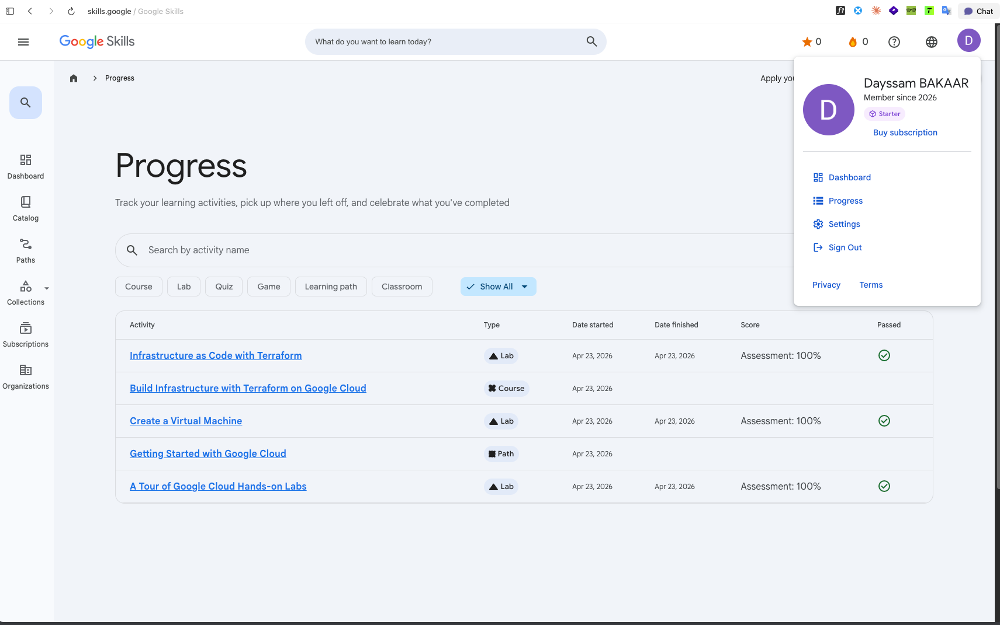

# Rapport de projet DevOps — AstroSpot

> **Binôme :** Dayssam BAKAAR — _(ajouter le co-équipier)_
> **Date limite :** 21 juin · **Dépôt :** Moodle
> **Sujet (libre) :** planificateur de soirées d'observation des étoiles
> **Langage (libre) :** TypeScript (Node.js 22)

---

## 1. Présentation et cas d'usage

**AstroSpot** répond à une question concrète : _« Vaut-il la peine de sortir le télescope ce
soir, à cet endroit ? »_ L'application croise deux facteurs déterminants pour l'astronomie
amateur :

- la **pollution lumineuse** du site (échelle de Bortle, 1 = ciel pur → 9 = ciel urbain) ;
- la **couverture nuageuse** prévue, récupérée auprès d'une **API météo externe** (Open-Meteo).

Elle en déduit un **score de qualité du ciel** (0–100), une **note** (EXCELLENT / GOOD / FAIR /
POOR) et une **recommandation** binaire.

Ce découpage fonctionnel impose **deux services back** qui communiquent par HTTP, ce qui rend les
**mocks web** pleinement justifiés (voir §6).

---

## 2. Architecture logicielle

### 2.1 Vue micro-services

> Schéma complet (Mermaid) : [`docs/ARCHITECTURE.md`](docs/ARCHITECTURE.md).

```
  Front web ──HTTP──▶ spot-service ──HTTP──▶ sky-service ──HTTP──▶ Open-Meteo (externe)
   (nginx)             :3001 │                 :3002 │
                            ▼                        ▼
                       PostgreSQL            Catalogue pollution lumineuse
```

### 2.2 Architecture en couches (imposée par le sujet)

| Couche               | `spot-service`                                | `sky-service`                                   |
| -------------------- | --------------------------------------------- | ----------------------------------------------- |
| **Controller (web)** | `controller/spotController.ts`                | `controller/skyController.ts`                   |
| **Services**         | `services/spotService.ts`, `skyClient.ts`     | `services/skyConditionsService.ts`, `weatherClient.ts` |
| **Data**             | `data/spotRepository.ts` (in-mem + PostgreSQL)| `data/lightPollutionRepository.ts`              |

Chaque couche ne dépend que de la couche inférieure, **via une interface**, ce qui permet de
substituer les implémentations (ex. in-memory ↔ PostgreSQL) sans impact.

---

## 3. Choix techniques DevOps

| Besoin                | Choix                                  |
| --------------------- | -------------------------------------- |
| Langage               | TypeScript `strict`                    |
| Framework web         | Express                                |
| Tests unitaires       | Jest                                   |
| Tests HTTP (Controller)| Supertest                             |
| Mocks web             | nock                                   |
| Couverture            | Istanbul (intégré à Jest)              |
| Qualité statique      | ESLint + Prettier                      |
| Conteneurs            | Docker (multi-stage) + docker-compose  |
| Base de données       | PostgreSQL 16                          |
| CI                    | GitHub Actions                         |

---

## 4. Conteneurisation (≥ 2 services back avec Docker)

`docker-compose.yml` orchestre **4 conteneurs** : `spot-service`, `sky-service`, `postgres`,
`frontend`. Chaque service back possède un `Dockerfile` multi-stage (build TypeScript puis image
runtime minimale `node:22-alpine`) avec `HEALTHCHECK`.

```bash
make up   # docker compose up --build  ->  front sur http://localhost:8080
```

---

## 5. Rapports de tests et de couverture de code

Commande : `make coverage` (rapports HTML dans `services/*/coverage/lcov-report/index.html`).

| Service        | Tests | Statements | Branches | Functions | Lines     |
| -------------- | ----- | ---------- | -------- | --------- | --------- |
| `sky-service`  | 30    | 100 %      | 92.59 %  | 100 %     | **100 %** |
| `spot-service` | 26    | 98.07 %    | 94.11 %  | 100 %     | **98.07 %** |

> Sorties brutes : [`docs/reports/coverage-sky-service.txt`](docs/reports/coverage-sky-service.txt),
> [`docs/reports/coverage-spot-service.txt`](docs/reports/coverage-spot-service.txt).
> Des seuils minimaux sont **imposés** dans `jest.config.js` (`coverageThreshold`) : la CI échoue
> si la couverture passe sous 80 % (branches) / 85 % (lignes).

### Tests par couche

| Couche        | Type               | Outils           |
| ------------- | ------------------ | ---------------- |
| Data          | unitaire           | Jest             |
| Services      | unitaire + mocks   | Jest, nock       |
| Controller    | intégration HTTP   | Supertest, nock  |
| Inter-service | mock web           | nock             |

---

## 6. Mocks web

Deux frontières HTTP sont simulées avec **nock** :

1. `sky-service → Open-Meteo` (API météo externe) — `weatherClient.test.ts`,
2. `spot-service → sky-service` (appel inter-service) — `skyClient.test.ts`,
   `spotController.test.ts`.

Cela permet de tester chaque service de façon **isolée et déterministe**, sans dépendre du réseau.

---

## 7. Qualité logicielle

- TypeScript en mode `strict` (+ `noUnusedLocals`, `noUnusedParameters`) ;
- ESLint (`eslint:recommended` + `@typescript-eslint/recommended`) — **0 erreur** ;
- Prettier + `.editorconfig` pour un formatage homogène ;
- découplage par interfaces (injection de dépendances manuelle) ;
- gestion d'erreurs typée (`NotFoundError`, `ValidationError`) mappée sur les codes HTTP.

---

## 8. Pipeline d'intégration continue (CI)

`.github/workflows/ci.yml`, déclenché à chaque _push_ / _pull request_ :

1. **Job `test`** (matrice sur les 2 services) : `npm ci` → `lint` → `build` → `test:coverage`,
   puis publication des rapports de couverture en artefacts ;
2. **Job `docker`** : build des 3 images Docker + validation de `docker compose config`.

> Pas de Continuous Delivery (hors programme).

---

## 9. Captures d'écran des Google Labs (Google Skills)

Labs et parcours Google Cloud réalisés (Assessment **100 %**) :

- _A Tour of Google Cloud Hands-on Labs_ (Lab)
- _Getting Started with Google Cloud_ (Path)
- _Create a Virtual Machine_ (Lab)
- _Build Infrastructure with Terraform on Google Cloud_ (Course)
- _Infrastructure as Code with Terraform_ (Lab)



---

## 10. Limites et perspectives

- Open-Meteo ne couvre que ~16 jours de prévision ; au-delà, `sky-service` renvoie un `502`
  (dégradation gracieuse testée).
- Le catalogue de pollution lumineuse est volontairement restreint (couche Data en mémoire),
  aisément remplaçable par une base dédiée.
- Évolutions possibles : authentification, historique des sessions en base, phase lunaire.

---

## Annexe — Démarrage rapide

```bash
make install     # dépendances des 2 services
make lint        # qualité statique
make coverage    # tests + couverture
make up          # stack complète (Docker)
```
