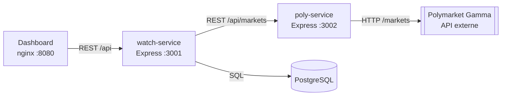
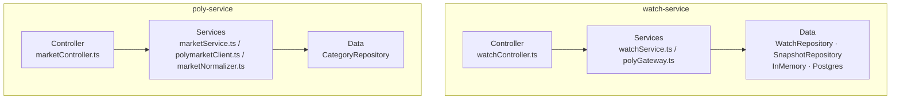
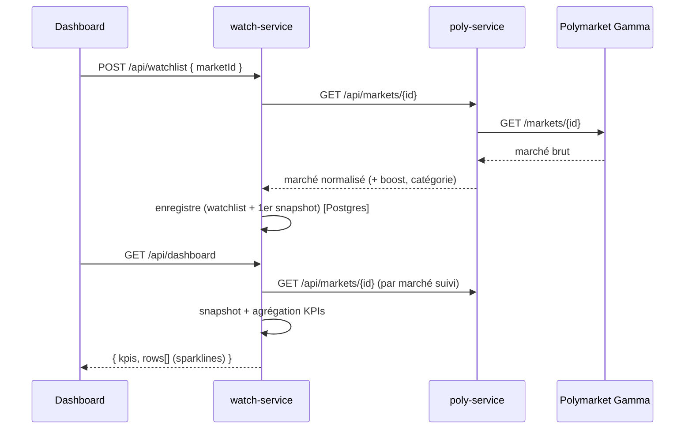

# Architecture logicielle — PolyPulse

## 1. Vue d'ensemble (micro-services)



`watch-service` porte le domaine (watchlist, snapshots, KPIs) ; `poly-service` est un service de
calcul sans état qui encapsule l'API Polymarket et détecte les marchés boostés.

## 2. Architecture en couches (par service)



**Règle de dépendance :** chaque couche ne dépend que de la couche inférieure, via une
**interface** (`WatchRepository`, `SnapshotRepository`, `PolymarketClient`, `PolyGateway`,
`CategoryRepository`). Les implémentations en mémoire et PostgreSQL sont interchangeables.

## 3. Détection « boosté » et score

```
boosted = rewardsMinSize > 0  OU  holdingRewardsEnabled
score   = 40·(rewardsMinSize>0) + 40·(holdingRewards) + 20·min(1, rewardsMaxSpread/5)   # [0,100]
```

## 4. Séquence : ajouter un marché et rafraîchir le dashboard



## 5. Stratégie de test par couche

| Couche        | Type de test       | Outils           | Exemple                              |
| ------------- | ------------------ | ---------------- | ------------------------------------ |
| Data          | unitaire           | Jest             | `categoryRepository.test.ts`, `repositories.test.ts` |
| Services      | unitaire + mocks   | Jest, nock       | `marketNormalizer.test.ts`, `watchService.test.ts` |
| Controller    | intégration HTTP   | Supertest + nock | `marketController.test.ts`, `watchController.test.ts` |
| Inter-service | mock web           | nock             | `polyGateway.test.ts`                |

Les **mocks web (nock)** interceptent les deux frontières HTTP : l'API Polymarket Gamma (externe)
et l'appel `watch-service → poly-service`, pour des tests isolés et déterministes.
