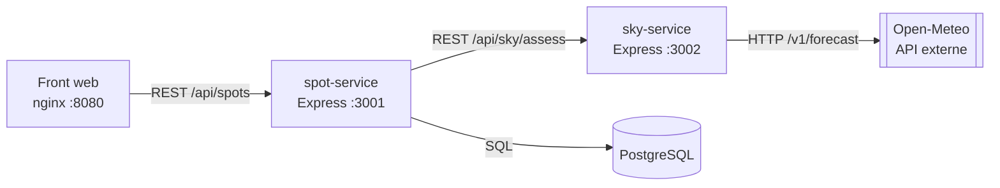
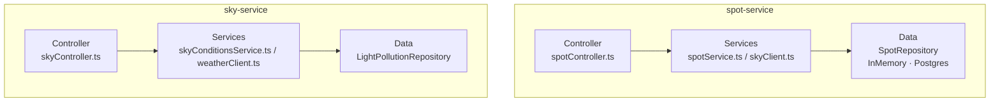
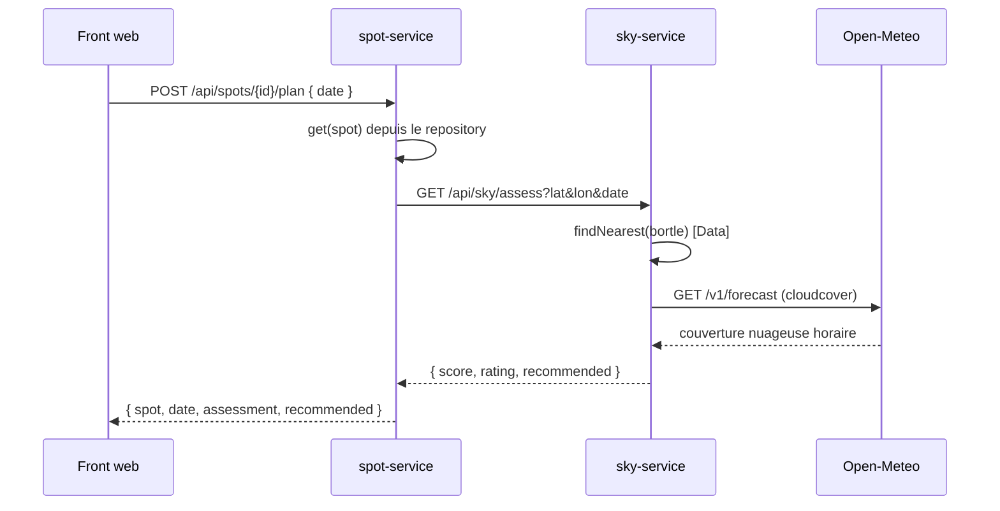

# Architecture logicielle — AstroSpot

## 1. Vue d'ensemble (micro-services)



Deux services back indépendants, conteneurisés et orchestrés par `docker-compose`.
`spot-service` est le service de domaine (spots & planification) ; `sky-service` est un
service de calcul (qualité du ciel) réutilisable et sans état.

## 2. Architecture en couches (par service)



**Règle de dépendance :** une couche ne dépend que de la couche immédiatement inférieure,
et toujours via une **interface** (`SpotRepository`, `WeatherClient`, `SkyGateway`). C'est
ce découplage qui rend chaque couche testable isolément et permet de substituer
l'implémentation en mémoire par PostgreSQL sans toucher au reste.

## 3. Calcul du score de qualité du ciel

```
lightScore = (9 − bortleClass) / 8 × 100      # Bortle 1 (ciel pur) -> 100, Bortle 9 (ville) -> 0
cloudScore = 100 − couvertureNuageuseMoyenne  # %
score      = round(0.5 × lightScore + 0.5 × cloudScore)   # borné [0, 100]

rating  = EXCELLENT (≥80) | GOOD (≥60) | FAIR (≥40) | POOR (<40)
recommended = score ≥ 60
```

## 4. Séquence : planifier une observation



## 5. Stratégie de test par couche

| Couche      | Type de test          | Outils                       | Exemple de fichier                         |
| ----------- | --------------------- | ---------------------------- | ------------------------------------------ |
| Data        | unitaire              | Jest                         | `lightPollutionRepository.test.ts`         |
| Services    | unitaire + mocks      | Jest (jest.fn), nock         | `skyConditionsService.test.ts`, `weatherClient.test.ts` |
| Controller  | intégration HTTP      | Supertest + nock             | `skyController.test.ts`, `spotController.test.ts` |
| Inter-service | mock web            | nock                         | `skyClient.test.ts`                        |

Les **mocks web (nock)** interceptent les deux frontières HTTP : l'API météo externe et
l'appel `spot-service → sky-service`, ce qui permet de tester chaque service de façon
totalement isolée et déterministe.
